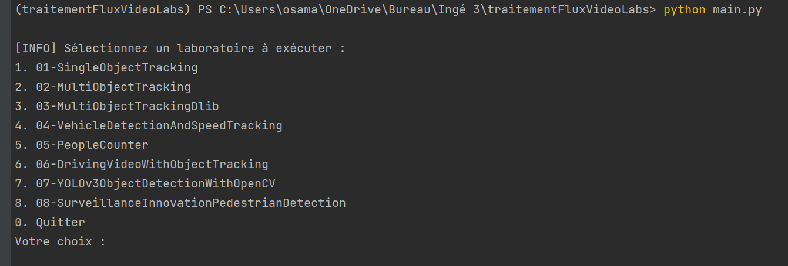

# Traitement Flux Vidéo - Laboratoires

## Introduction
Ce projet s'inscrit dans le cadre de la matière **Traitement Flux Vidéo** et regroupe plusieurs laboratoires (labs) visant à développer des compétences en suivi et détection d'objets dans des vidéos.  
L'objectif principal est de fournir un ensemble de scripts fonctionnels pour des tâches spécifiques telles que :  
- Suivi d'objets  
- Détection de véhicules  
- Estimation de vitesse  
Ainsi que des techniques avancées comme **YOLO** pour la détection d'objets en temps réel.  

Un menu interactif permet l'exécution de chacun de ces laboratoires de manière intuitive.  

## Objectif du Projet
L'objectif est de :  
- Créer un environnement modulaire permettant de sélectionner et d'exécuter différents labs.  
- Permettre l'analyse et le traitement de flux vidéo en utilisant des techniques avancées de vision par ordinateur.  
- Faciliter la gestion et l'exécution des projets de manière centralisée via un script principal.  

## Description des Labs
Chaque laboratoire aborde une problématique spécifique liée à la vision par ordinateur et au traitement de flux vidéo.  

### Liste des Laboratoires :
1. **01-SingleObjectTracking**  
   _Suivi d'un objet unique dans une vidéo._  
   Utilisation de techniques de tracking classiques pour le suivi en temps réel.  

2. **02-MultiObjectTracking**  
   _Implémentation d'un système de suivi pour plusieurs objets simultanément._  

3. **03-MultiObjectTrackingDlib**  
   _Utilisation de MobileNet-SSD et Dlib pour suivre des objets dans des vidéos._  

4. **04-VehicleDetectionAndSpeedTracking**  
    _Mise en œuvre d'un système de détection et de suivi de véhicules, avec estimation de leur vitesse._  

5. **05-PeopleCounter**  
   _Système de comptage de personnes basé sur la détection d'objets dans une vidéo._  

6. **06-DrivingVideoWithObjectTracking**  
   _Application de suivi d'objets dans des vidéos de surveillance._  

7. **07-YOLOv3ObjectDetectionWithOpenCV**  
   _Utilisation de YOLOv3 avec OpenCV pour la détection rapide d'objets._  

8. **08-SurveillanceInnovationPedestrianDetection**  
   _Système avancé de détection de piétons pour des applications de surveillance._  

---

## Fonctionnement du Menu Interactif
Le script `main.py` à la racine du projet agit comme un point d'entrée central.  
Il présente à l'utilisateur une liste des labs disponibles et lui permet d'exécuter celui de son choix.  

### Étapes de Fonctionnement :  
1. Lors du lancement du script, un menu s'affiche avec la liste des laboratoires.  
2. L'utilisateur sélectionne le lab à exécuter en entrant le numéro correspondant.  
3. Le script recherche et exécute le fichier `main.py` situé dans le dossier du laboratoire sélectionné.  

### Exemple de Menu Interactif :

## Introduction

Ce projet s'inscrit dans le cadre de la matière **Traitement Flux Vidéo** et regroupe plusieurs laboratoires (labs) visant à développer des compétences en suivi et détection d'objets dans des vidéos. L'objectif principal est de fournir un ensemble de scripts fonctionnels pour des tâches spécifiques telles que le suivi d'objets, la détection de véhicules, et l'estimation de vitesse, ainsi que des techniques avancées comme YOLO pour la détection d'objets en temps réel.

Un menu interactif a été mis en place pour permettre l'exécution de chacun de ces laboratoires de manière intuitive. Ce menu facilite la navigation et l'exécution des différents scripts `main.py` situés dans chaque dossier de laboratoire.

## Objectif du Projet

L'objectif est de :

- Créer un environnement modulaire permettant de sélectionner et d'exécuter différents labs.
- Permettre l'analyse et le traitement de flux vidéo en utilisant des techniques avancées de vision par ordinateur.
- Faciliter la gestion et l'exécution des projets de manière centralisée via un script principal.

## Description des Labs

Chaque laboratoire aborde une problématique spécifique liée à la vision par ordinateur et au traitement de flux vidéo. Voici une présentation des différents labs :

1. [**01-SingleObjectTracking**](https://www.notion.so/01-SingleObjectTracking-16fc80d0d59d8073a2abe318a365049e?pvs=21) : Suivi d'un objet unique dans une vidéo. Utilisation de techniques de tracking classiques pour le suivi en temps réel.
2. [**02-Suivi de Plusieurs Objets (MultiObjectTracking)**](https://www.notion.so/02-Suivi-de-Plusieurs-Objets-MultiObjectTracking-16fc80d0d59d80ce83b0e6dde7d675a2?pvs=21) : Implémentation d'un système de suivi pour plusieurs objets simultanément.
3. [**03-Suivi d'objets avec MobileNet-SSD et Dlib**](https://www.notion.so/03-Suivi-d-objets-avec-MobileNet-SSD-et-Dlib-16fc80d0d59d805d9127d3681580d510?pvs=21) : Utilisation de MobileNet-SSD et Dlib pour suivre des objets dans des vidéos.
4. [**04-Détection et Suivi de Véhicules avec Estimation de Vitesse**](https://www.notion.so/04-D-tection-et-Suivi-de-V-hicules-avec-Estimation-de-Vitesse-16fc80d0d59d80659463fea4fc9cf3ee?pvs=21) : Mise en œuvre d'un système de détection et de suivi de véhicules, avec estimation de leur vitesse.
5. [**05-Compteur de Personnes**](https://www.notion.so/05-Compteur-de-Personnes-16fc80d0d59d80a2b08cdc92e6038857?pvs=21) : Système de comptage de personnes basé sur la détection d'objets dans une vidéo.
6. [**06-Suivi et Détection d'Objets dans des Vidéos**](https://www.notion.so/06-Suivi-et-D-tection-d-Objets-dans-des-Vid-os-16fc80d0d59d802c9c75f559074b97d7?pvs=21) : Application de suivi d'objets dans des vidéos de surveillance.
7. [**07-Détection d'Objets avec YOLOv3 et OpenCV**](https://www.notion.so/07-D-tection-d-Objets-avec-YOLOv3-et-OpenCV-16fc80d0d59d80aaacd8d6968b647627?pvs=21) : Utilisation de YOLOv3 avec OpenCV pour la détection rapide d'objets.
8. [**08-SurveillanceInnovationPedestrianDetection**](https://www.notion.so/08-SurveillanceInnovationPedestrian-Detection-16fc80d0d59d8071a519f35a8d076705?pvs=21) : Système avancé de détection de piétons pour des applications de surveillance.

[01-SingleObjectTracking](https://www.notion.so/01-SingleObjectTracking-16fc80d0d59d8073a2abe318a365049e?pvs=21)

[02-Suivi de Plusieurs Objets (MultiObjectTracking)](https://www.notion.so/02-Suivi-de-Plusieurs-Objets-MultiObjectTracking-16fc80d0d59d80ce83b0e6dde7d675a2?pvs=21)

[03-Suivi d'objets avec MobileNet-SSD et Dlib](https://www.notion.so/03-Suivi-d-objets-avec-MobileNet-SSD-et-Dlib-16fc80d0d59d805d9127d3681580d510?pvs=21)

[04-Détection et Suivi de Véhicules avec Estimation de Vitesse](https://www.notion.so/04-D-tection-et-Suivi-de-V-hicules-avec-Estimation-de-Vitesse-16fc80d0d59d80659463fea4fc9cf3ee?pvs=21)

[05- **Compteur de Personnes**](https://www.notion.so/05-Compteur-de-Personnes-16fc80d0d59d80a2b08cdc92e6038857?pvs=21)

[06-**Suivi et Détection d'Objets dans des Vidéos**](https://www.notion.so/06-Suivi-et-D-tection-d-Objets-dans-des-Vid-os-16fc80d0d59d802c9c75f559074b97d7?pvs=21)

[07- **Détection d'Objets avec YOLOv3 et OpenCV**](https://www.notion.so/07-D-tection-d-Objets-avec-YOLOv3-et-OpenCV-16fc80d0d59d80aaacd8d6968b647627?pvs=21)

[08-SurveillanceInnovationPedestrian Detection](https://www.notion.so/08-SurveillanceInnovationPedestrian-Detection-16fc80d0d59d8071a519f35a8d076705?pvs=21)

[Rapport Projet : MoodEye](https://www.notion.so/Rapport-Projet-MoodEye-174c80d0d59d80d084f6e0620eeafc4c?pvs=21)

## Fonctionnement du Menu Interactif

Le script `main.py` à la racine du projet agit comme un point d'entrée central. Il présente à l'utilisateur une liste des labs disponibles et lui permet d'exécuter celui de son choix.

- Lors du lancement du script, un menu s'affiche avec la liste des laboratoires.
- L'utilisateur sélectionne le lab à exécuter en entrant le numéro correspondant.
- Le script recherche et exécute le fichier `main.py` situé dans le dossier du laboratoire sélectionné.


---

## Dépendances et Installation

### Prérequis :
- **Python 3.7 ou supérieur**  
- **OpenCV** (`opencv-python` et `opencv-contrib-python`)  
- **imutils**  
- **dlib**  
- **ffmpeg** (pour la conversion vidéo si nécessaire)  

### Installation des Dépendances :

### Exemple de Menu Interactif :

```
[INFO] Sélectionnez un laboratoire à exécuter :
1. 01-SingleObjectTracking
2. 02-MultiObjectTracking
3. 03-MultiObjectTrackingDlib
4. 04-VehicleDetectionAndSpeedTracking
5. 05-PeopleCounter
6. 06-DrivingVideoWithObjectTracking
7. 07-YOLOv3ObjectDetectionWithOpenCV
8. 08-SurveillanceInnovationPedestrianDetection
0. Quitter
Votre choix : _
```



---

## Conclusion
Le système mis en place permet une exécution rapide et efficace des différents laboratoires, facilitant ainsi l'apprentissage et l'expérimentation dans le domaine du traitement de flux vidéo.  

Chaque laboratoire offre une opportunité unique d'approfondir des techniques spécifiques, avec la flexibilité d'exécution offerte par ce menu interactif.
